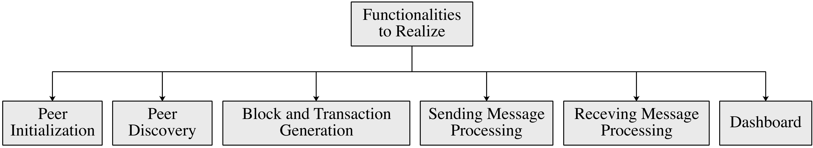
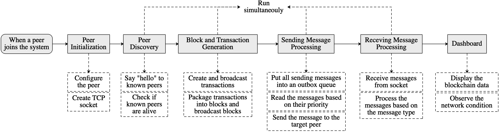

# CS305 2025 春季期末项目 - 区块链网络模拟

**我们将根据本规范的最新版本对所有项目进行评分。请仔细阅读本项目规范并跟踪更新！！！**

**重要提示：我们尽力使本规范尽可能清晰，并涵盖我们在测试中遇到的所有问题。但是，我们仍然遗漏本规范中的重要细节并不少见。如果任何内容不清楚，您应该立即在此存储库中提交问题或联系讲师和助教，而不是猜测您必须做什么。再次强调，如果您有任何问题，请在开始之前与讲师和助教确认。**

## 1. 简介

比特币（BTC）和以太坊（ETH）是最广为人知和最安全的加密货币系统之一。它们允许用户在不透露身份或不依赖银行或支付宝等中心化平台的情况下转移数字货币（例如 BTC 和 ETH）。这些功能是通过**区块链技术**实现的。

区块链是一个去中心化的账本，它存储着不断增长的记录序列，这些记录被称为**区块**，通过加密哈希安全地连接起来。每个区块都包含前一个区块的哈希、一个时间戳和一系列交易（通常以默克尔树的形式组织，交易位于叶子）。这种设计形成了一种链式结构，每个区块都与其前一个区块链接，类似于链表。由于每个区块都依赖于其前一个区块的完整性，因此追溯修改数据将需要修改所有后续区块并在网络中实现**共识**。这使得区块链系统高度抗篡改，并有助于防止双重支付、伪造、欺诈和未经授权的资产创建等问题。

我们以以太坊为例。以太坊是一个公共区块链，任何对等节点（peer）都可以自由加入或离开。系统中的实体被称为区块链对等节点（以下简称**对等节点**），它们不仅可以生成交易，还可以验证其他对等节点生成的交易，并将有效交易打包成区块。这些区块随后由系统中的所有对等节点验证，如果大多数对等节点接受它们，则将它们链接到区块链。这个过程称为**区块链共识**（即区块生成和验证）。在这里，每个对等节点都在本地存储一份区块链副本。因此，一个区块被链接到区块链意味着每个对等节点都在其本地区块链中存储该区块。区块链共识确保所有对等节点存储相同的区块链副本。

<em>图 1：区块链系统如何运作（节点 = 对等节点）。</em>

在每个区块周期（即生成一个区块的时间间隔）中，基本操作是：

1. 对等节点生成新交易并将其广播到系统中的所有对等节点。
2. 选择一个对等节点作为区块生成器，将交易打包成一个区块。
3. 新区块被广播到系统中的所有对等节点。
4. 对等节点验证区块的有效性。
5. 如果大多数对等节点接受该区块，则该区块被附加到区块链中。因此，区块中的交易被永久存储在区块链中。恶意对等节点如果意图修改区块链中的一个区块，将需要更改所有后续区块，这需要所有对等节点重新验证这些区块；这在比特币中被认为是不可行的。

本项目侧重于模拟这种区块链系统中的对等网络（P2P）通信。要模拟的核心功能包括：

- 对等节点初始化
- 对等节点发现
- 消息发送/接收
- 交易和区块生成
- 仪表板监控

要实现的功能总结在图 2 中。

<!---
In this project, we will focus on how peers in a blockchain system communicate to exchange data (e.g., transactions and blocks). We can see from Figure 1 that a blockchain system is implemented based on the **peer-to-peer (P2P) network**, in which peers exchange data directly without any centralized entities. This project aims at simulating this blockchain P2P network, which includes the functionality of **peer discovery**, **sending message processing** and **receiving message processing**. Moreover, for exchanging transactions and blocks, a simplified **transaction and block generation** is simulated. Finally, **peer initialization** is necessary before running a peer, and a **dashboard** is used to observe the operation of the network. The functionalities to be realized are summarized in Figure 2.
-->

<em>图 2：本项目要完成的功能。</em>

---

## 2. 区块链 P2P 网络的功能

<em>图 3：不同功能如何交互。</em>

图 3 显示了不同功能之间的关系。下面描述了系统的每个核心组件。

---

### 第 1 部分：对等节点初始化

加入网络后，对等节点：

* 配置其 `IP 地址`、`端口`和 `gossip fanout`，以及
* 选择其角色：`正常`或 `恶意`、`轻量级`或 `完整`、`NATed`或 `非 NATed`。
* 初始化一个 TCP 套接字以接收传入消息。

**关键术语：**

* `gossip fanout`：在区块链中，对等节点在广播区块和交易时通常采用 gossip 协议。也就是说，每个对等节点将区块或交易发送给其已知对等节点的一个随机子集，而不是所有已知对等节点。这可以减少网络中的冗余消息。在这里，`gossip fanout` 表示在广播区块和交易时目标对等节点的数量。
* `正常`或 `恶意`对等节点：正常对等节点总是生成正确的交易和区块。相反，恶意对等节点可以生成不正确的交易和区块（例如，具有错误的区块 ID）。
* `轻量级`或 `完整`对等节点：在介绍中，我们提到所有对等节点都验证区块并存储区块链的副本，这被称为完整对等节点。然而，在实践中，存在一些资源受限的设备（例如，手机和笔记本电脑），它们没有足够的计算和存储能力来验证和存储所有区块。为了解决这个问题，以太坊允许对等节点充当轻量级对等节点，它们不验证区块也不存储所有区块。相反，轻量级对等节点存储区块头而没有交易。
* `NATed`或 `非 NATed`对等节点：本项目考虑网络地址转换（NAT）。NATed 对等节点通常位于本地网络中，无法直接与本地网络之外的对等节点交互。相反，本地网络中的非 NATed 对等节点充当 NAT 路由器或 NATed 对等节点与本地网络之外的对等节点之间的中继对等节点。通常，当将外部消息转发到本地网络中的对等节点时，中继对等节点必须根据 NAT 转换表找到目标对等节点在本地网络中的 IP 地址。在这里，为了降低复杂性，我们只模拟 NAT 的逻辑，而忽略 NAT 转换表；也就是说，NATed 对等节点在整个网络中只有一个 IP 地址。

---

### 第 2 部分：对等节点发现

创建 TCP 套接字后，对等节点通知已知对等节点其存在以交换数据。为此，对等节点在加入网络之前必须获取一些对等节点的 IP 地址和端口。

此外，对等节点需要定期检查已知对等节点是否存活。

对等节点发现的步骤如下：

* 在加入网络时向其已知对等节点说 `hello`。
* 当收到 `hello` 消息时，检查发送方是否已知。如果未知，则将发送方添加到已知对等节点列表。
* 定期向所有已知对等节点发送 `ping` 消息并等待它们的回复，即 `pong` 消息。
* 当收到 `pong` 消息时，更新已知对等节点的状态。此外，计算发送 `ping` 消息和接收 `pong` 消息之间的时间差，这是对等节点之间的传输延迟。
* 如果在超时前没有收到 `pong` 消息，则移除无响应的对等节点。

---

### 第 3 部分：区块和交易生成与验证

初始化对等节点并找到已知对等节点后，完整对等节点开始生成和验证交易和区块。本项目中，每个完整对等节点定期生成一个交易并将其广播给其他完整对等节点进行验证。

如果交易 ID 正确，则交易有效。这些交易也存储在对等节点的本地交易池 `tx_pool` 中。

由于我们只关注区块链 P2P 网络中的交易和区块交换，因此我们在此简化了区块生成。在每个区块周期中，每个对等节点独立地将其 `tx_pool` 中的交易打包成一个区块，并将其广播给其他对等节点进行验证，而不是选择一个区块生成器来生成区块。如果 `区块 ID` 正确，则区块有效。

交易/区块生成和验证的步骤如下：

* 在加入网络时从已知对等节点同步最新的区块链，以便将新区块链接到最新的区块链。
* 开始生成交易。
* 将交易广播给已知对等节点进行验证。
* 将有效交易添加到本地 `tx_pool`。
* 将本地 `tx_pool` 中的交易打包成一个新区块。
* 将区块广播给已知对等节点进行验证。
* 将有效区块添加到本地区块链。

**提示：**

* 当一个对等节点向另一个对等节点发送区块时，发送方通常发送带有区块 ID 的 `INV` 消息，而不是区块本身。如果接收方发现它尚未收到该区块，接收方将回复 `GETBLOCK` 消息以请求该区块。这可以减少网络开销。

---

### 第 4 部分：发送消息处理

为了模拟发送消息（例如交易和区块）的过程，所有发送消息都必须放入一个发件箱队列并逐一发送。发送消息的步骤如下：

* 发送消息时，将消息添加到发件箱队列。
* 根据消息的优先级从队列中读取消息。
* 如果消息目的地是非 NATed 对等节点，则直接将消息发送到目的地。
* 如果消息目的地是 NATed 对等节点，则找到最佳中继对等节点并将消息发送到中继对等节点。

---

### 第 5 部分：接收消息处理

当从其他对等节点接收消息时，必须根据消息类型调度和处理消息。接收消息的处理如下：

* 检查消息发送方是否被禁止。如果发送方被禁止，则丢弃消息。
* 检查发送方发送的消息数量是否在限制内。如果发送方发送消息过于频繁，则丢弃消息。这是为了防止拒绝服务（DoS）攻击。
* 检查消息类型并相应地处理消息：

  * msg.type=`TX`，

    * 检查交易的有效性。如果无效，则丢弃交易并记录发送方的违规行为。
    * 检查交易是否已被接收。如果是，则丢弃交易以防止重放攻击。
    * 如果已收到冗余交易，则记录冗余交易的数量。
    * 如果尚未收到新交易，则将其添加到本地 `tx_pool`。
    * 将新交易广播给已知对等节点。
  * msg.type=`BLOCK`，

    * 检查区块的有效性。如果无效，则丢弃区块并记录发送方的违规行为。
    * 检查区块是否已在本地区块链中。如果是，则丢弃区块以防止重放攻击。
    * 如果已收到冗余区块，则记录冗余区块的数量。
    * 如果其前一个区块由于网络延迟而不在区块链中，则将新区块添加到孤立区块列表。
    * 如果其前一个区块在区块链中，则将新区块添加到本地区块链。
    * 检查新区块是否是孤立区块的前一个区块。
    * 将新区块广播给已知对等节点。
  * msg.type=`INV`，

    * 检查 INV 消息中的区块 ID 是否已被接收。
    * 向消息发送方请求缺失的区块。
  * msg.type=`GETBLOCK`，

    * 检查请求的区块是否在本地区块链中。如果不在，则向已知对等节点请求区块。
    * 如果发送方是完整对等节点，则回复请求的区块。
    * 如果发送方是轻量级对等节点，则回复请求区块的区块头。
  * msg.type=`GET_BLOCK_HEADERS`

    * 回复本地区块链中区块的区块头。
  * msg.type=`BLOCK_HEADERS`

    * 通过检查每个区块的前一个区块是否存在于区块链中来检查区块头列表的有效性。
    * 如果对等节点是完整对等节点，则向已知对等节点请求缺失的区块。

---

### 第 6 部分：启动仪表板

启动一个仪表板服务器以显示以下消息：

* `Localhost: port/peers`：显示已知对等节点的集合。
* `Localhost: port/transactions`：显示本地池中的交易。
* `Localhost: port/blocks`：显示本地区块链中的区块。
* `Localhost: port/orphan`：显示孤立区块。
* `Localhost: port/latency`：显示对等节点之间的传输延迟。
* `Localhost: port/capacity`：显示对等节点的发送容量。
* `Localhost: port/redundancy`：显示收到的冗余消息数量。

---

## 3. 要完成的功能

项目的操作逻辑在 `node.py` 的 `Main` 函数中给出。您的任务是实现以下模块：

---

### 第 1 部分：对等节点初始化 (`socket_server.py`)

1. `start_socket_server`

* 创建一个 TCP 套接字并将其绑定到对等节点的 IP 地址和端口。
* 开始监听套接字以接收传入消息。
* 接收到消息时，将消息传递给 `message_handler.py` 中的 `dispatch_message` 函数。

---

### 第 2 部分：对等节点发现

#### `peer_discovery.py`：此部分负责在对等节点加入系统时向已知对等节点发送“hello”。

1. `start_peer_discovery`

* 定义 `hello` 消息的 JSON 格式，其中应包含：`{消息类型, 发送方 ID, IP 地址, 端口, 标志, 消息 ID}`。`发送方 ID` 可以是 `peer_port`。`标志` 应指示对等节点是 `NATed 还是非 NATed`，以及 `完整还是轻量级`。`消息 ID` 可以是一个随机数。
* 向所有已知对等节点发送 `hello` 消息并将消息放入发件箱队列。

2. `handle_hello_message`

* 读取收到的 `hello` 消息中的信息。
* 如果发送方未知，则将其添加到已知对等节点列表（`known_peer`）并记录其标志（`peer_flags`）。
* 更新可达对等节点集合（`reachable_by`）。

**提示：** 每个对等节点只能从可达对等节点接收 `hello` 消息，并且永远不会转发 `hello` 消息。如果一个对等节点从 NATed 对等节点接收到 `hello` 消息，它可以充当该 NATed 对等节点的中继对等节点。

#### `peer_manager.py`：此部分负责检查已知对等节点的状态并记录其性能。

1. `start_ping_loop`

* 定义 `ping` 消息的 JSON 格式，其中应包含 `{消息类型, 发送方 ID, 时间戳}`。
* 定期向每个已知对等节点发送 `ping` 消息。

2. `create_pong`

* 创建 `pong` 消息的 JSON 格式，其中应包含 `{消息类型, 发送方 ID, 收到 ping 消息中的时间戳}`。

3. `handle_pong`

* 读取收到的 `pong` 消息中的信息。
* 更新对等节点与发送方之间的传输延迟（`rtt_tracker`）。

4. `start_peer_monitor`

* 检查 `last_ping_time` 中每个对等节点收到 `ping` 或 `pong` 消息的最新时间。
* 如果最新时间早于限制，则将 `us` 中对等节点的状态标记为 `UNREACHABLE`，否则标记为 `ALIVE`。

5. `update_peer_heartbeat`

* 在收到对等节点的 `ping` 或 `pong` 消息时更新对等节点的 `last_ping_time`。

6. `record_offense`

* 检测到恶意行为时记录对等节点的违规次数。
* 如果对等节点的违规次数超过 3 次，则将其添加到 `blacklist`。

---

### 第 3 部分：区块和交易生成与验证

#### `transaction.py`：此部分处理所有与交易相关的函数。

1. `transaction_generation`

* 从 `known_peers` 中随机选择一个对等节点，并生成一个交易以向该对等节点转移任意数量的资金。
* 使用 `add_transaction` 函数将交易添加到本地 `tx_pool`。
* 使用 `outbox.py` 中的 `gossip_message` 函数将交易广播给 `known_peers`。

2. `add_transaction`

* 如果交易在池中，则将其添加到本地 `tx_pool`。
* 将交易 ID 添加到 `tx_ids`。

3. `get_recent_transaction`

* 返回本地 `tx_pool` 中的所有交易。

4. `clear_pool`

* 移除 `tx_pool` 中的所有交易和 `tx_ids` 中的交易 ID。

#### `block_handler.py`：此部分处理所有与区块相关的函数。

1. `request_block_sync`

* 定义 `GET_BLOCK_HEADERS` 的 JSON 格式，其中应包含 `{消息类型, 发送方 ID}`。
* 向每个已知对等节点发送 `GET_BLOCK_HEADERS` 消息（以获取最新区块链中的区块头列表）并将消息放入发件箱队列。

2. `block_generation`

* 使用 `create_dummy_block` 函数定期创建一个新区块。
* 使用 `inv_message.py` 中的 `create_inv` 函数为新区块创建一个 `INV` 消息。
* 使用 `outbox.py` 中的 `gossip` 函数将 `INV` 消息广播给已知对等节点。

3. `create_dummy_block`

* 定义 `区块` 的 JSON 格式，其中应包含 `{消息类型, 对等节点 ID, 时间戳, 区块 ID, 前一个区块的 ID, 交易}`。`区块 ID` 是区块结构（除了 `区块 ID` 项）的哈希值。`前一个区块` 是区块链中的最后一个区块，新区块将链接到它。如果区块生成器是恶意的，它可以生成一个随机的区块 ID。
* 在清除本地交易池之前，使用 `transaction.py` 中的 `get_recent_transactions` 函数读取本地 `tx_pool` 中的交易。
* 使用交易创建一个新区块，并使用 `compute_block_hash` 函数生成区块 ID。
* 将新区块添加到本地区块链（`receive_block`）。

4. `compute_block_hash`

* 计算区块的哈希值，除了 `区块 ID` 项。

5. `handle_block`

* 检查收到的区块中 `区块 ID` 的正确性。如果错误，则丢弃区块并记录发送方的违规行为。
* 检查区块是否存在于本地区块链中。如果是，则丢弃区块。
* 检查区块的前一个区块是否存在于本地区块链中。如果不存在，则将区块添加到孤立区块列表（`orphan_blocks`）。如果存在，则将区块（对于完整对等节点）或区块头（对于轻量级对等节点）添加到本地区块链。
* 检查区块是否是 `orphan_blocks` 中区块的前一个区块。如果是，则将孤立区块添加到本地区块链。

6. `create_getblock`

* 定义 `GETBLOCK` 消息的 JSON 格式，其中应包含 `{消息类型, 发送方 ID, 请求的区块 ID}`。

7. `get_block_by_id`

* 根据区块 ID 返回本地区块链中的区块。

#### `inv_message.py`：此部分在交换区块时处理 `INV` 消息。

1. `create_inv`

* 定义 `INV` 消息的 JSON 格式，其中应包含 `{消息类型, 发送方 ID, 发送区块的 ID, 消息 ID}`。请注意，`INV` 消息在发送区块之前发送。`发送区块的 ID` 是发送方要发送的区块的 ID。`消息 ID` 可以是 `util.py` 中 `generate_message_id` 生成的随机数。

2. `get_inventory`

* 返回本地区块链中所有区块的区块 ID。

3. `broadcast_inventory`

* 创建包含本地区块链中所有区块 ID 的 `INV` 消息。
* 使用 `outbox.py` 中的 `gossip_message` 函数将 `INV` 消息广播给已知对等节点，以与已知对等节点同步区块链。

---

### 第 4 部分：发送消息处理 (`outbox.py`)

1. `enqueue_message`：此函数将所有发送消息放入发件箱队列。

* 使用 `is_rate_limited` 函数检查对等节点是否向接收方发送消息过于频繁。如果是，则丢弃消息。
* 检查接收方是否存在于 `blacklist` 中。如果是，则丢弃消息。
* 使用 `classify_priority` 函数根据消息类型对发送消息的优先级进行分类。
* 如果队列长度在 `QUEUE_LIMIT` 限制内，则将消息添加到队列（`queues`），否则丢弃消息。

2. `is_rate_limited`

* 检查在当前结束的 `TIME_WINDOW` 期间，从对等节点发送到目标对等节点的消息数量。
* 如果发送频率超过发送速率限制 `RATE_LIMIT`，则返回 `TRUE`；否则，将当前发送时间记录到 `peer_send_timestamps`。

3. `classify_priority`

* 根据消息类型对消息的优先级进行分类。

4. `send_from_queue` (`outbox.py`)

* 读取队列中的消息。每次读取目标对等节点中优先级最高的一条消息。发送消息后，读取下一个目标对等节点的消息。这确保了向不同目标对等节点发送消息的公平性。
* 使用 `relay_or_direct_send` 函数发送消息，该函数将决定是直接发送消息给目标对等节点还是通过中继对等节点发送。
* 如果消息发送失败，则重试消息，如果重试次数超过限制 `MAX_RETRIES`，则丢弃消息。

5. `relay_or_direct_send`

* 检查目标对等节点是否是 NATed。
* 如果目标对等节点是 NATed，则使用 `get_relay_peer` 函数找到最佳中继对等节点。定义 `RELAY` 消息的 JSON 格式，其中应包含 `{消息类型, 发送方 ID, 目标对等节点 ID, `payload `}`。`payload` 是发送的消息。使用 `send_message` 函数将 `RELAY` 消息发送给最佳中继对等节点。
* 如果目标对等节点是非 NATed，则使用 `send_message` 函数将消息发送给目标对等节点。

6. `get_relay_peer`

* 在 `peer_discovery.py` 的 `reachable_by` 中找到可从目标对等节点到达的中继候选节点集合。
* 读取 `peer_manager.py` 的 `rtt_tracker` 中发送方与其他对等节点之间的传输延迟。
* 选择并返回传输延迟最小的最佳中继对等节点。

7. `send_message`

* 将消息发送给目标对等节点。使用 `apply_network_condition` 函数将 `send_message` 函数包装在动态网络条件下。

8. `apply_network_conditions`：此函数模拟对等节点的发送容量控制、消息丢弃和消息传输延迟。

* 使用 `rate_limiter.allow` 函数检查对等节点的发送速率是否超出限制。如果是，则丢弃消息并更新丢弃状态（`drop_stats`）。
* 生成一个随机数。如果它小于 `DROP_PROB`，则丢弃消息以模拟通道中的随机消息丢弃。更新丢弃状态（`drop_stats`）。
* 在发送消息之前添加一个随机延迟以模拟消息传输延迟。
* 使用 `send_func` 函数发送消息。

9. `start_dynamic_capacity_adjustment`

* 定期将对等节点在 `rate_limiter` 中的发送容量更改为 [2, 10] 范围内的值。

10. `gossip_message`

* 读取 `peer_discovery.py` 中对等节点的配置 `fanout`。
* 从 `known_peers` 中随机选择等于 `fanout` 数量的目标对等节点。如果 gossip 消息是交易，则跳过 `known_peers` 中的轻量级对等节点。
* 将消息发送给选定的目标对等节点并将其放入发件箱队列。

11. `get_outbox_status`

* 返回发件箱队列中的消息。

12. `get_drop_stats`

* 返回丢弃状态（`drop_stats`）。

---

### PART 5: 接收消息处理 (`message_handler.py`)

1. `dispatch_message`

* 读取消息。
* 检查消息是否已在 `seen_message_ids` 中，以防止重放攻击。如果是，则丢弃消息并将 `message_redundancy` 加一。如果不是，则将消息 ID 添加到 `seen_message_ids`。
* 检查发送方是否发送消息过于频繁。如果是，则丢弃消息。
* 检查发送方是否存在于 `peer_manager.py` 的 `blacklist` 中。如果是，则丢弃消息。
* 根据消息类型处理消息：

  * msg_type == "RELAY":

    * 检查对等节点是否是目标对等节点。
    * 如果是，则提取有效负载并再次调用 `dispatch_message` 函数处理有效负载。
    * 如果不是，则使用 `outbox.py` 中的 `enqueue_message` 函数将消息转发给目标对等节点。
  * msg_type == "HELLO"

    * 调用 `peer_discovery.py` 中的 `handle_hello_message` 函数处理消息。
  * msg_type == "BLOCK"

    * 检查区块 ID 的正确性。如果错误，则记录发送方的违规行为。
    * 调用 `block_handler.py` 中的 `handle_block` 函数处理区块。
    * 调用 `create_inv` 函数为区块创建 `INV` 消息。
    * 广播 `INV` 消息给已知对等节点。
  * msg_type == "TX"

    * 检查交易 ID 的正确性。如果错误，则记录发送方的违规行为。
    * 将交易添加到 `tx_pool`。
    * 广播交易给已知对等节点。
  * msg_type == "PING"

    * 更新上次 ping 时间。
    * 创建 `pong` 消息并发送给发送方。
  * msg_type == "PONG"

    * 更新上次 ping 时间。
    * 调用 `peer_manager.py` 中的 `handle_pong` 函数处理消息。
  * msg_type == "INV"

    * 读取本地区块链中所有区块 ID。
    * 比较本地区块 ID 与消息中的区块 ID。
    * 如果存在缺失区块，则创建 `GETBLOCK` 消息并发送给发送方。
  * msg_type == "GETBLOCK"

    * 提取区块 ID。
    * 从本地区块链中获取区块。
    * 如果区块不在本地，则向已知对等节点请求缺失区块。
    * 如果区块存在，则逐一发送给请求方。
  * msg_type == "GET_BLOCK_HEADERS"

    * 读取本地区块链中所有区块头。
    * 创建 `BLOCK_HEADERS` 消息并发送给请求方。
  * msg_type == "BLOCK_HEADERS"

    * 检查每个区块的前一个区块是否存在于本地区块链或收到的区块头中。
    * 如果存在且对等节点是轻量级，则将区块头添加到本地区块链。
    * 如果存在且对等节点是完整对等节点，则检查是否存在缺失区块并请求。
    * 如果不存在，则丢弃消息。

2. `is_inbound_limited`

* 记录从发送方收到消息的时间戳。
* 检查在 `INBOUND_TIME_WINDOW` 期间发送方发送的消息数量是否超过 `INBOUND_RATE_LIMIT`。如果是，则返回 `TRUE`。如果不是，则返回 `FALSE`。

3. `get_redundancy_stats`

* 返回收到重复消息的次数（`message_redundancy`）。

---

### 第 6 部分：仪表板 (`dashboard.py`)

* `peers`：显示已知对等节点的信息，包括 `{对等节点 ID, IP 地址, 端口, 状态, NATed 或非 NATed, 轻量级或完整}`。
* `transactions`：显示本地池 `tx_pool` 中的交易。
* `blocks`：显示本地区块链中的区块。
* `orphan`：显示孤立区块。
* `latency`：显示对等节点之间的传输延迟。
* `capacity`：显示对等节点的发送容量。
* `redundancy`：显示收到的冗余消息数量。

---

## 4. 测试方法

本项目将基于 Docker 技术部署区块链 P2P 网络，其中每个对等节点在独立的容器中运行。在容器中运行对等节点的步骤可以总结如下：

1) 编写 `Dockerfile` 以构建对等节点的容器镜像。该镜像可用于生成多个容器，即对等节点。
2) 在 `docker-compose.yml` 中定义对等节点，包括容器数量、容器运行方式以及它们如何相互连接。
3) 使用 `docker compose build` 为 `docker-compose.yml` 中的所有服务构建镜像。
4) 使用 `docker compose up` 生成并启动 `docker-compose.yml` 中指定的容器。

我们已经在启动代码中提供了 `Dockerfile` 和 `docker-compose.yml`，包含十个对等节点。通过这两个文件，我们将使用以下命令检查您的项目：

1) `docker compose up --build` 检查每个对等节点是否正确运行。
2) `localhost:port/{参数}` 检查对等节点是否正确生成和传输交易和区块。

**奖励：**

1) **动态区块链网络**：在上述测试方法中，区块链 P2P 网络中的对等节点数量是固定的。您可以向项目中添加额外的功能并修改 Docker 文件，以允许对等节点动态加入或离开系统而不影响其他对等节点的操作。为不同的新对等节点使用不同的 `config.json`，以便新加入的对等节点可能不知道网络中存在的所有对等节点。
2) **冗余消息的原因**：探索可能影响对等节点接收冗余消息数量的参数，例如，`fanout` 越大，传输到网络并由对等节点接收的消息就越多。更改参数的值以观察对等节点接收的冗余消息数量。绘制图表以显示它们之间的关系。

---

## 5. 评分

**总分：100 分**

1) 对等节点初始化 (5 分)
2) 对等节点发现 (10 分)
3) 区块和交易生成与验证 (20 分)
4) 发送消息处理 (25 分)
5) 接收消息处理 (25 分)
6) 仪表板 (5 分)
7) **期望提供一份关于实现细节、见解和改进的全面报告。(10 分)**

**奖励分数：最高 20 分**
我们将根据您的实现进行评分。
